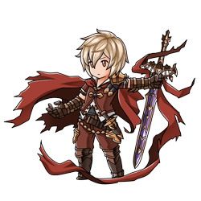

  
  

## Hi there 👋

---

### :man_technologist: About Me :

I am a Full Stack Web Developer from France. I tend to prefer backend stuff 😅

I have a full time job and one of my hobby (when i have the time) is game modding.

You can find my works on my profiles but i'm mostly working on:

- [TF.EX](https://github.com/Fcornaire/TF.EX) A rollback netcode/matchmaker mod for TowerFall
- [SlopCrew](https://github.com/SlopCrew/SlopCrew) By [NotNite](https://github.com/NotNite), contribued to add the race mod
- [BRCreator](https://github.com/Fcornaire/BRCreator) A unity plugin for creating race for [SlopCrew](https://github.com/SlopCrew/SlopCrew)
- [ACTBossesRespawner](https://github.com/Fcornaire/ACTBossesRespawner) A mod to let you re fight previous on the game `Another crab's threasure`
-
[HBWAbilitySwitcher](https://github.com/Fcornaire/HBWAbilitySwitcher) Ability Switcher for `Haste Broken Worlds`

Consider a small support of my patreon if you like my works 😅 (or want to help with maintaining [TF.EX](https://github.com/Fcornaire/TF.EX) matchmaking server )

---

### :hammer_and_wrench: Languages and Tools :

  &nbsp;
  &nbsp;
  &nbsp;
  &nbsp;
  &nbsp;
  &nbsp;
  &nbsp;
  &nbsp;
  

---

### :fire: My Stats :

<!--
**Fcornaire/Fcornaire** is a ✨ _special_ ✨ repository because its `README.md` (this file) appears on your GitHub profile.

Here are some ideas to get you started:

- 🔭 I’m currently working on ...
- 🌱 I’m currently learning ...
- 👯 I’m looking to collaborate on ...
- 🤔 I’m looking for help with ...
- 💬 Ask me about ...
- 📫 How to reach me: ...
- 😄 Pronouns: ...
- ⚡ Fun fact: ...
-->
